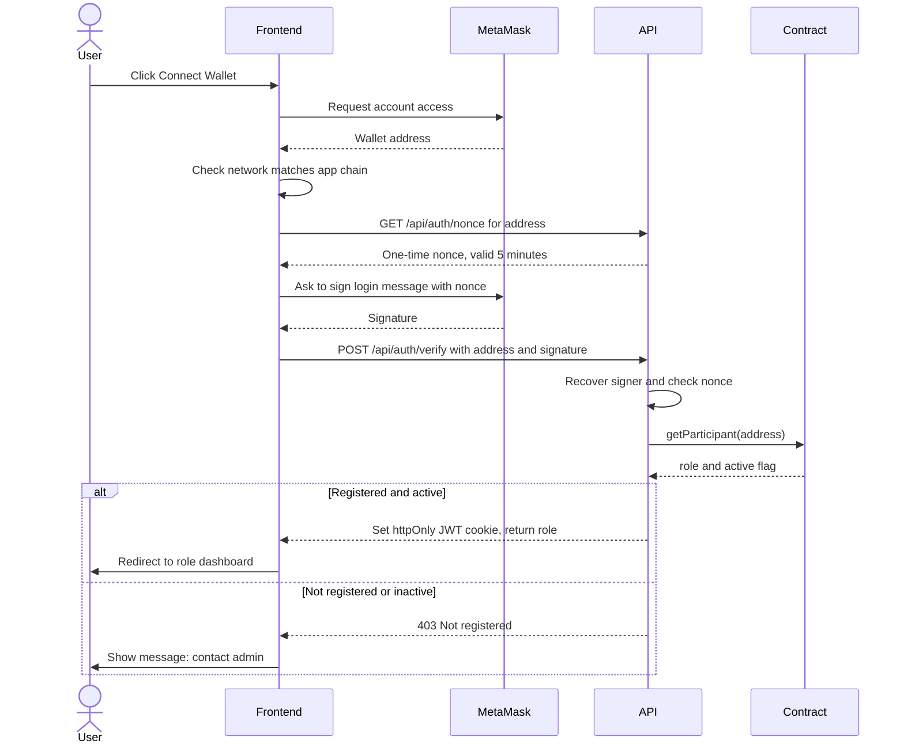
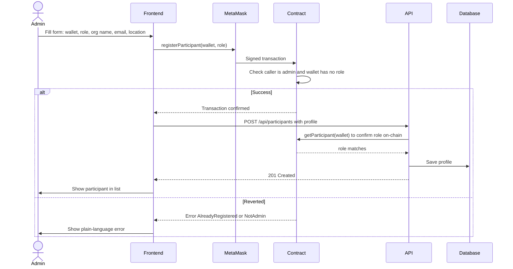
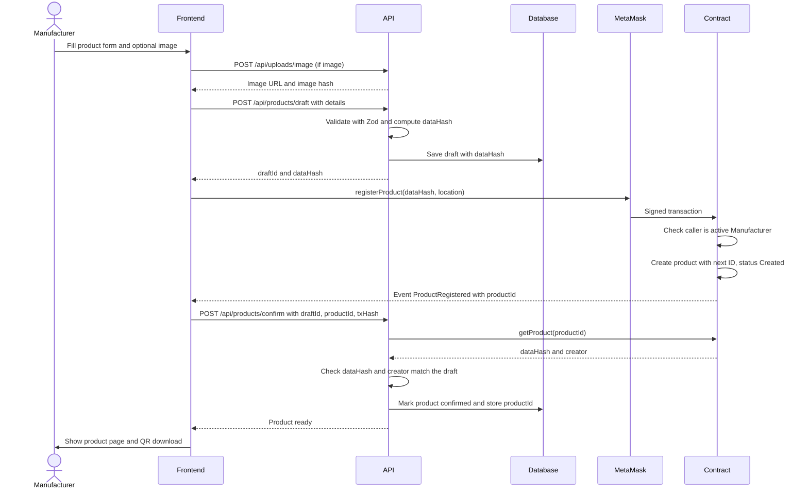
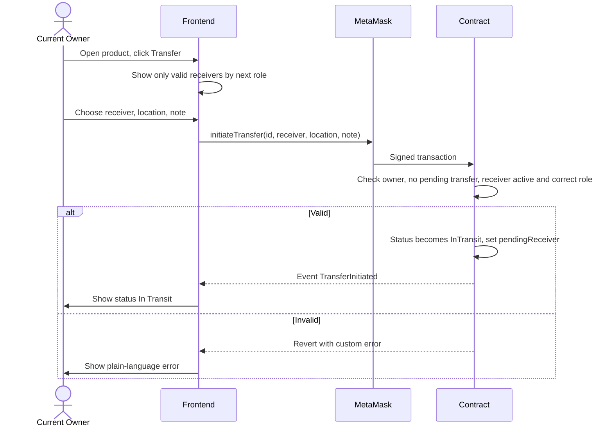
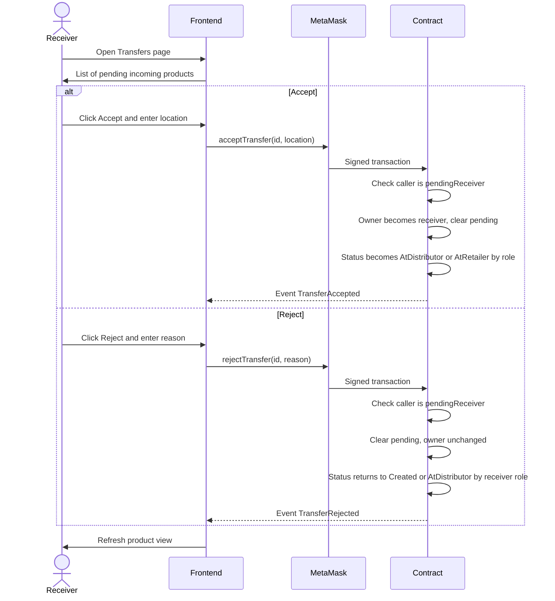
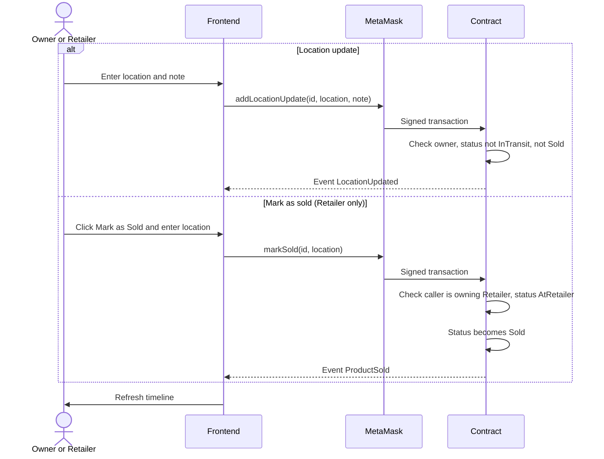
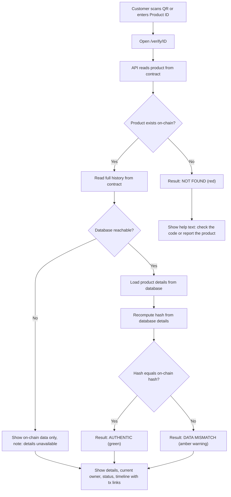
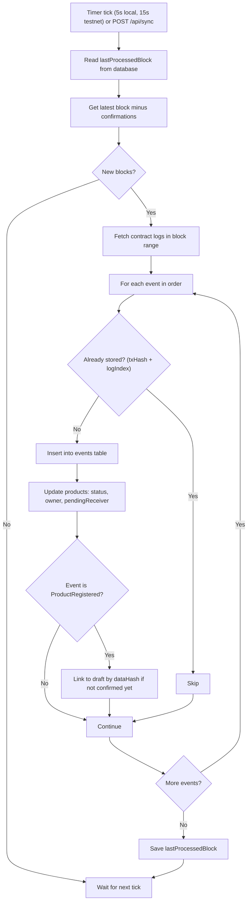
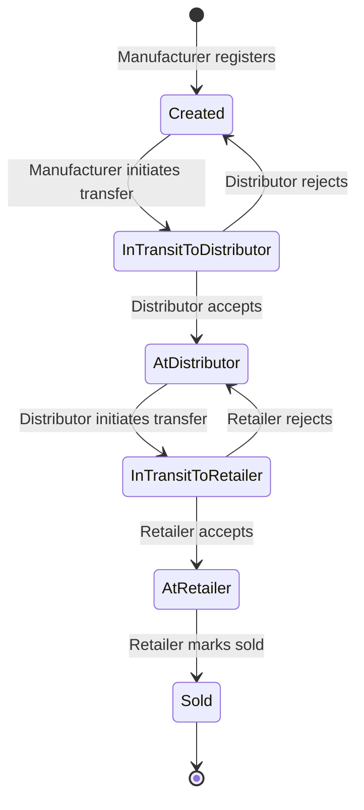
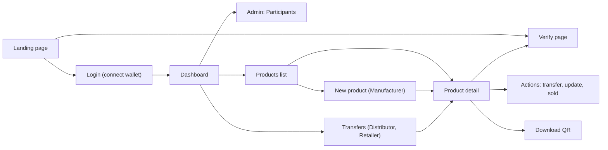

# System Flow Document
**Project:** ChainTrack – Blockchain Supply Chain Tracker
**Document:** 3 of 5 (PRD → TRD → **System Flow** → Schema & Contract Design → Implementation Plan)
**Version:** 1.0
**Depends on:** 01-PRD.md, 02-TRD.md

> Diagrams use Mermaid. They render in GitHub, VS Code (Markdown Preview Mermaid extension), and most AI IDEs. If a viewer shows raw text, paste the block into https://mermaid.live.

## Flow Index

| ID | Flow | Actor |
|----|------|-------|
| FLOW-01 | Wallet login | All roles |
| FLOW-02 | Participant onboarding | Admin |
| FLOW-03 | Product registration | Manufacturer |
| FLOW-04 | Transfer: initiate, accept, reject | Owner, Receiver |
| FLOW-05 | Location update and mark as sold | Owner, Retailer |
| FLOW-06 | Public verification (QR scan) | Customer |
| FLOW-07 | Indexer sync | System |
| FLOW-08 | Product state machine | Reference |
| FLOW-09 | Role and action matrix | Reference |
| FLOW-10 | Screen navigation by role | Reference |
| FLOW-11 | Error and edge cases | Reference |

---

## FLOW-01: Wallet Login (FR-01 to FR-04)

**Rules**
- Nonce is single use; a reused or expired nonce returns 401.
- If the network is wrong, the UI shows a "Switch network" button before asking for a signature.
- Admin is recognized by matching the contract owner address.

---

## FLOW-02: Participant Onboarding (FR-05 to FR-07)

**Deactivate:** Admin calls `setParticipantActive(wallet, false)` on-chain, then `PATCH /api/participants/:address` updates the profile flag. The contract value is what enforces access.

---

## FLOW-03: Product Registration (FR-08 to FR-12)

**Rules**
- If the wallet transaction is rejected or fails, the draft stays unconfirmed and expires after 24 hours.
- If `confirm` fails after a successful transaction, the indexer still picks up `ProductRegistered` and links it to the matching draft using `dataHash`. Nothing is lost.
- QR content: `{APP_BASE_URL}/verify/{productId}`.

---

## FLOW-04: Transfer of Custody (FR-13 to FR-16)

### 4A. Initiate

### 4B. Accept or Reject

**Rules**
- The status after reject or accept is derived from the receiver's role, so no "previous status" field is needed.
- A product with a pending transfer cannot be transferred again or marked sold (FR-16).

---

## FLOW-05: Location Update and Mark as Sold (FR-17, FR-18)

---

## FLOW-06: Public Verification (FR-19 to FR-22)

**Notes**
- No login and no wallet needed.
- Each timeline entry shows: event type, actor organization and wallet, time, location, and a transaction link.
- Recalled or suspicious flags (stretch, FR-26 and FR-27) appear as an extra banner.

---

## FLOW-07: Indexer Sync

**Rules**
- Processing is idempotent, and a restart resumes from `lastProcessedBlock`.
- Range size is capped per run (for example 2000 blocks) to respect RPC limits.

---

## FLOW-08: Product State Machine

On-chain `Status` has 5 values. `InTransit` is shown as two sub-states below because the destination role decides where accept or reject leads.

Location updates do not change state; they append an event while the product is in `Created`, `AtDistributor`, or `AtRetailer`.

---

## FLOW-09: Role and Action Matrix

| Action | Admin | Manufacturer | Distributor | Retailer | Customer |
|--------|:-----:|:------------:|:-----------:|:--------:|:--------:|
| Register or deactivate participant | Yes | | | | |
| View all participants and products | Yes | | | | |
| Register product | | Yes | | | |
| Download QR | Yes | Yes (own) | | | |
| Initiate transfer | | Yes (owner) | Yes (owner) | | |
| Accept or reject transfer | | | Yes (receiver) | Yes (receiver) | |
| Add location update | | Yes (owner) | Yes (owner) | Yes (owner) | |
| Mark as sold | | | | Yes (owner) | |
| View own dashboard and products | Yes (all) | Yes | Yes | Yes | |
| Verify product and timeline | Yes | Yes | Yes | Yes | Yes (no login) |

Every "Yes" is enforced by the contract; the UI only hides what a role cannot do.

---

## FLOW-10: Screen Navigation by Role

---

## FLOW-11: Error and Edge Cases

| Situation | System behavior | User sees |
|-----------|-----------------|-----------|
| MetaMask not installed | Detect missing wallet provider | "Install MetaMask" with link |
| Wrong network | Block actions | Banner with "Switch network" button |
| User rejects signature or transaction | No state change; draft (if any) expires | "Transaction cancelled" |
| Transaction reverts | Map custom error to message | Plain message, for example "You are not the owner of this product" |
| Transaction slow | Poll for receipt | "Waiting for confirmation…" with tx link |
| Unregistered wallet logs in | 403 from API | "Not registered, contact admin" |
| Participant deactivated mid-session | Contract rejects writes; API re-checks role | "Your account is deactivated" |
| Product ID does not exist | Contract returns not found | Verify page: Not Found |
| Database down | Verify reads chain only | On-chain result with "details unavailable" |
| RPC down | API returns 503 | "Blockchain unreachable, retry" button |
| Off-chain data edited directly | Hash mismatch | Verify page: Data Mismatch warning |
| Confirm call fails after successful transaction | Indexer links by `dataHash` | Product appears after next sync |
| Duplicate submit (double click) | Buttons disabled while pending; draft ID is single use | No duplicate product |
| Upload invalid (type or size) | Zod and server check | "Only JPG, PNG, WEBP up to 2 MB" |
| Transfer to wrong role | Contract revert `InvalidReceiver` | "Receiver must be a Distributor" (or Retailer) |

---

## Complete Demo Walkthrough (Maps to PRD Acceptance Criteria)

1. Admin logs in (FLOW-01) and registers Manufacturer, Distributor, Retailer (FLOW-02).
2. Manufacturer registers a product and downloads its QR (FLOW-03).
3. Manufacturer transfers to Distributor; Distributor accepts (FLOW-04).
4. Distributor adds a location update (FLOW-05).
5. Distributor transfers to Retailer; Retailer accepts (FLOW-04).
6. Retailer marks the product as sold (FLOW-05).
7. Customer scans the QR and sees Authentic with the full timeline (FLOW-06).
8. Demo the failure cases: wrong role action, reject flow, edited database (Data Mismatch), and unknown ID (Not Found).

---
*Next document: 04 – Backend Schema and Contract Design (database tables, contract code structure, ABI-level details).*
