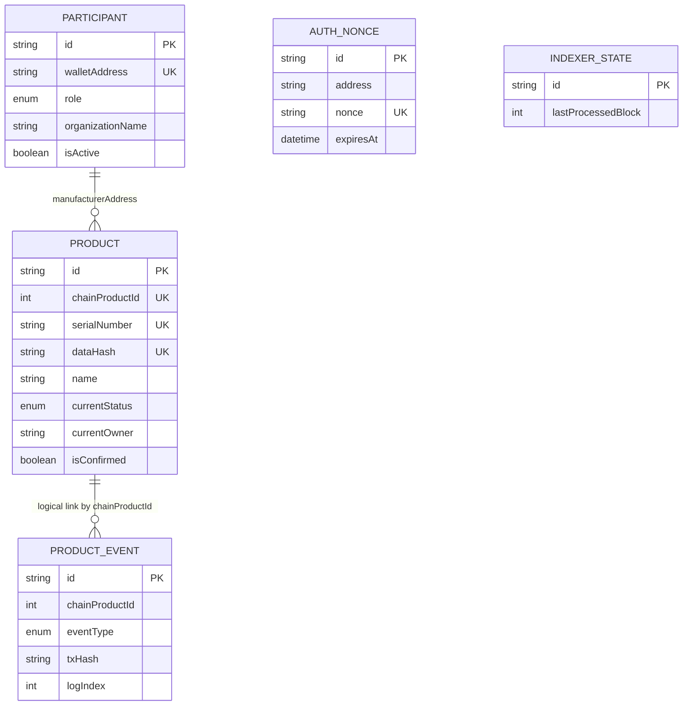

# Backend Schema and Contract Design
**Project:** ChainTrack – Blockchain Supply Chain Tracker
**Document:** 4 of 5 (PRD → TRD → System Flow → **Schema & Contract Design** → Implementation Plan)
**Version:** 1.0
**Depends on:** 01-PRD.md, 02-TRD.md, 03-System-Flow.md

This document has two parts:
- **Part A:** Smart contract design (on-chain data and rules)
- **Part B:** Database schema (off-chain data)

---

# PART A: SMART CONTRACT DESIGN

## A1. Overview

| Item | Value |
|------|-------|
| Contract name | `SupplyChain` |
| File | `contracts/contracts/SupplyChain.sol` |
| Solidity | `^0.8.24` |
| Optimizer | Enabled, 200 runs (turn on `viaIR` only if "stack too deep" appears) |
| Dependencies | None (own `admin` variable, no OpenZeppelin needed) |
| Ether handling | None. No payable functions, no receive or fallback |

## A2. Types

### Enums

| Enum | Values (in order, value 0 first) |
|------|----------------------------------|
| `Role` | `None`(0), `Manufacturer`(1), `Distributor`(2), `Retailer`(3) |
| `Status` | `Created`(0), `InTransit`(1), `AtDistributor`(2), `AtRetailer`(3), `Sold`(4) |
| `EventType` | `Registered`(0), `TransferInitiated`(1), `TransferAccepted`(2), `TransferRejected`(3), `LocationUpdate`(4), `Sold`(5) |

### Structs

| Struct | Fields |
|--------|--------|
| `Participant` | `Role role`, `bool active` |
| `Product` | `uint256 id`, `bytes32 dataHash`, `address manufacturer`, `address currentOwner`, `address pendingReceiver`, `Status status`, `uint64 createdAt` |
| `HistoryEntry` | `EventType eventType`, `address actor`, `address counterparty`, `uint64 timestamp`, `string location`, `string note` |

### Storage

| Variable | Type | Purpose |
|----------|------|---------|
| `admin` | `address immutable` | Deployer; only admin can manage participants |
| `productCount` | `uint256` | Last used product ID (IDs start at 1) |
| `participants` | `mapping(address => Participant)` | Role registry |
| `products` | `mapping(uint256 => Product)` | Product core data |
| `histories` | `mapping(uint256 => HistoryEntry[])` | Append-only event log per product |
| `hashUsed` | `mapping(bytes32 => bool)` | Prevents two products sharing one data hash |

### Limits

| Constant | Value |
|----------|-------|
| `MAX_LOCATION_LENGTH` | 100 bytes |
| `MAX_NOTE_LENGTH` | 280 bytes |

## A3. Function Rules

`Caller` must always be an **active participant** unless stated otherwise.

| Function | Caller | Preconditions | Effects |
|----------|--------|---------------|---------|
| `registerParticipant(wallet, role)` | Admin | wallet not zero; role not None; wallet has no role yet | Save role, active = true |
| `setParticipantActive(wallet, active)` | Admin | wallet has a role | Update active flag |
| `registerProduct(dataHash, location)` | Manufacturer | hash not zero and unused; location length ok | New product, status Created, owner = caller, history entry Registered |
| `initiateTransfer(id, to, location, note)` | Current owner | Status is Created or AtDistributor; `to` active and has the next role (Created → Distributor, AtDistributor → Retailer) | Status InTransit, `pendingReceiver = to`, history entry |
| `acceptTransfer(id, location)` | Pending receiver | Status InTransit | Owner = caller, pending cleared, status AtDistributor (if caller is Distributor) or AtRetailer (if Retailer) |
| `rejectTransfer(id, reason)` | Pending receiver *(active check not required)* | Status InTransit | Pending cleared, owner unchanged, status Created (if receiver is Distributor) or AtDistributor (if Retailer) |
| `addLocationUpdate(id, location, note)` | Current owner | Status is not InTransit and not Sold | History entry only |
| `markSold(id, location)` | Retailer who owns it | Status AtRetailer | Status Sold |

### View functions (anyone)

| Function | Returns |
|----------|---------|
| `getParticipant(wallet)` | `(Role role, bool active)` |
| `exists(id)` | `bool` |
| `getProduct(id)` | `Product` (reverts `ProductNotFound` if missing) |
| `getHistory(id)` | `HistoryEntry[]` (reverts `ProductNotFound` if missing) |
| `historyLength(id)` | `uint256` |
| `admin()`, `productCount()` | public getters |

### Design notes
- A role can never be changed once set, so the receiver's role reliably decides the next status.
- `rejectTransfer` does not require an active receiver so a deactivated receiver can still release a stuck product.
- Known limitation: if a receiver never responds, the product stays InTransit. A `cancelTransfer` by the sender is listed as a stretch item in the implementation plan.

## A4. Custom Errors

| Error | Raised when | User-facing message |
|-------|-------------|---------------------|
| `NotAdmin()` | Non-admin calls admin function | "Only the admin can do this" |
| `NotParticipant()` | Caller or wallet has no role | "This wallet is not registered" |
| `ParticipantInactive()` | Caller is deactivated | "Your account is deactivated" |
| `WrongRole()` | Caller's role cannot do this action | "Your role cannot perform this action" |
| `AlreadyRegistered()` | Wallet already has a role | "This wallet is already registered" |
| `InvalidRole()` | Role is None | "Invalid role" |
| `ZeroAddress()` | Zero address given | "Invalid wallet address" |
| `ProductNotFound()` | Unknown product ID | "Product not found" |
| `NotOwner()` | Caller is not current owner | "You are not the owner of this product" |
| `NotPendingReceiver()` | Caller is not the pending receiver | "This transfer is not addressed to you" |
| `InvalidStatus()` | Action not allowed in current status | "Not allowed in the current product status" |
| `InvalidReceiver()` | Receiver inactive or wrong role | "Receiver must be an active Distributor (or Retailer)" |
| `EmptyHash()` | Data hash is zero | "Invalid product data" |
| `DuplicateHash()` | Data hash already used | "This product data is already registered" |
| `StringTooLong()` | Location or note too long | "Text is too long" |

## A5. Events

| Event | Parameters (indexed marked) |
|-------|-----------------------------|
| `ParticipantRegistered` | `address indexed wallet`, `Role role` |
| `ParticipantStatusChanged` | `address indexed wallet`, `bool active` |
| `ProductRegistered` | `uint256 indexed productId`, `address indexed manufacturer`, `bytes32 dataHash`, `string location` |
| `TransferInitiated` | `uint256 indexed productId`, `address indexed from`, `address indexed to`, `string location`, `string note` |
| `TransferAccepted` | `uint256 indexed productId`, `address indexed by`, `string location` |
| `TransferRejected` | `uint256 indexed productId`, `address indexed by`, `string reason` |
| `LocationUpdated` | `uint256 indexed productId`, `address indexed by`, `string location`, `string note` |
| `ProductSold` | `uint256 indexed productId`, `address indexed by`, `string location` |

Event timestamps are not in the event data; the indexer reads them from the block.

## A6. Reference Implementation

> This is a design reference. Compile it, run the tests in A7, and fix anything the compiler reports.

```solidity
// SPDX-License-Identifier: MIT
pragma solidity ^0.8.24;

contract SupplyChain {
    // ---------- Types ----------
    enum Role { None, Manufacturer, Distributor, Retailer }
    enum Status { Created, InTransit, AtDistributor, AtRetailer, Sold }
    enum EventType {
        Registered, TransferInitiated, TransferAccepted,
        TransferRejected, LocationUpdate, Sold
    }

    struct Participant {
        Role role;
        bool active;
    }

    struct Product {
        uint256 id;
        bytes32 dataHash;
        address manufacturer;
        address currentOwner;
        address pendingReceiver;
        Status status;
        uint64 createdAt;
    }

    struct HistoryEntry {
        EventType eventType;
        address actor;
        address counterparty;
        uint64 timestamp;
        string location;
        string note;
    }

    // ---------- Constants ----------
    uint256 public constant MAX_LOCATION_LENGTH = 100;
    uint256 public constant MAX_NOTE_LENGTH = 280;

    // ---------- Storage ----------
    address public immutable admin;
    uint256 public productCount;

    mapping(address => Participant) private participants;
    mapping(uint256 => Product) private products;
    mapping(uint256 => HistoryEntry[]) private histories;
    mapping(bytes32 => bool) private hashUsed;

    // ---------- Errors ----------
    error NotAdmin();
    error NotParticipant();
    error ParticipantInactive();
    error WrongRole();
    error AlreadyRegistered();
    error InvalidRole();
    error ZeroAddress();
    error ProductNotFound();
    error NotOwner();
    error NotPendingReceiver();
    error InvalidStatus();
    error InvalidReceiver();
    error EmptyHash();
    error DuplicateHash();
    error StringTooLong();

    // ---------- Events ----------
    event ParticipantRegistered(address indexed wallet, Role role);
    event ParticipantStatusChanged(address indexed wallet, bool active);
    event ProductRegistered(uint256 indexed productId, address indexed manufacturer, bytes32 dataHash, string location);
    event TransferInitiated(uint256 indexed productId, address indexed from, address indexed to, string location, string note);
    event TransferAccepted(uint256 indexed productId, address indexed by, string location);
    event TransferRejected(uint256 indexed productId, address indexed by, string reason);
    event LocationUpdated(uint256 indexed productId, address indexed by, string location, string note);
    event ProductSold(uint256 indexed productId, address indexed by, string location);

    // ---------- Modifiers ----------
    modifier onlyAdmin() {
        if (msg.sender != admin) revert NotAdmin();
        _;
    }

    modifier onlyActiveParticipant() {
        Participant memory p = participants[msg.sender];
        if (p.role == Role.None) revert NotParticipant();
        if (!p.active) revert ParticipantInactive();
        _;
    }

    modifier whenExists(uint256 id) {
        if (id == 0 || id > productCount) revert ProductNotFound();
        _;
    }

    modifier onlyOwnerOf(uint256 id) {
        if (products[id].currentOwner != msg.sender) revert NotOwner();
        _;
    }

    constructor() {
        admin = msg.sender;
    }

    // ---------- Admin ----------
    function registerParticipant(address wallet, Role role) external onlyAdmin {
        if (wallet == address(0)) revert ZeroAddress();
        if (role == Role.None) revert InvalidRole();
        if (participants[wallet].role != Role.None) revert AlreadyRegistered();
        participants[wallet] = Participant(role, true);
        emit ParticipantRegistered(wallet, role);
    }

    function setParticipantActive(address wallet, bool active) external onlyAdmin {
        if (participants[wallet].role == Role.None) revert NotParticipant();
        participants[wallet].active = active;
        emit ParticipantStatusChanged(wallet, active);
    }

    // ---------- Manufacturer ----------
    function registerProduct(bytes32 dataHash, string calldata location)
        external
        onlyActiveParticipant
        returns (uint256 id)
    {
        if (participants[msg.sender].role != Role.Manufacturer) revert WrongRole();
        if (dataHash == bytes32(0)) revert EmptyHash();
        if (hashUsed[dataHash]) revert DuplicateHash();
        _checkLen(location, MAX_LOCATION_LENGTH);

        hashUsed[dataHash] = true;
        id = ++productCount;
        products[id] = Product({
            id: id,
            dataHash: dataHash,
            manufacturer: msg.sender,
            currentOwner: msg.sender,
            pendingReceiver: address(0),
            status: Status.Created,
            createdAt: uint64(block.timestamp)
        });
        _log(id, EventType.Registered, msg.sender, address(0), location, "");
        emit ProductRegistered(id, msg.sender, dataHash, location);
    }

    // ---------- Transfers ----------
    function initiateTransfer(
        uint256 id,
        address to,
        string calldata location,
        string calldata note
    ) external onlyActiveParticipant whenExists(id) onlyOwnerOf(id) {
        Product storage p = products[id];

        Role receiverRole;
        if (p.status == Status.Created) receiverRole = Role.Distributor;
        else if (p.status == Status.AtDistributor) receiverRole = Role.Retailer;
        else revert InvalidStatus();

        Participant memory r = participants[to];
        if (r.role != receiverRole || !r.active) revert InvalidReceiver();
        _checkLen(location, MAX_LOCATION_LENGTH);
        _checkLen(note, MAX_NOTE_LENGTH);

        p.status = Status.InTransit;
        p.pendingReceiver = to;
        _log(id, EventType.TransferInitiated, msg.sender, to, location, note);
        emit TransferInitiated(id, msg.sender, to, location, note);
    }

    function acceptTransfer(uint256 id, string calldata location)
        external
        onlyActiveParticipant
        whenExists(id)
    {
        Product storage p = products[id];
        if (p.status != Status.InTransit) revert InvalidStatus();
        if (p.pendingReceiver != msg.sender) revert NotPendingReceiver();
        _checkLen(location, MAX_LOCATION_LENGTH);

        address from = p.currentOwner;
        Role r = participants[msg.sender].role;
        p.status = (r == Role.Distributor) ? Status.AtDistributor : Status.AtRetailer;
        p.currentOwner = msg.sender;
        p.pendingReceiver = address(0);

        _log(id, EventType.TransferAccepted, msg.sender, from, location, "");
        emit TransferAccepted(id, msg.sender, location);
    }

    function rejectTransfer(uint256 id, string calldata reason)
        external
        whenExists(id)
    {
        Product storage p = products[id];
        if (p.status != Status.InTransit) revert InvalidStatus();
        if (p.pendingReceiver != msg.sender) revert NotPendingReceiver();
        _checkLen(reason, MAX_NOTE_LENGTH);

        Role r = participants[msg.sender].role;
        p.status = (r == Role.Distributor) ? Status.Created : Status.AtDistributor;
        p.pendingReceiver = address(0);

        _log(id, EventType.TransferRejected, msg.sender, p.currentOwner, "", reason);
        emit TransferRejected(id, msg.sender, reason);
    }

    // ---------- Updates and sale ----------
    function addLocationUpdate(uint256 id, string calldata location, string calldata note)
        external
        onlyActiveParticipant
        whenExists(id)
        onlyOwnerOf(id)
    {
        Status s = products[id].status;
        if (s == Status.InTransit || s == Status.Sold) revert InvalidStatus();
        _checkLen(location, MAX_LOCATION_LENGTH);
        _checkLen(note, MAX_NOTE_LENGTH);

        _log(id, EventType.LocationUpdate, msg.sender, address(0), location, note);
        emit LocationUpdated(id, msg.sender, location, note);
    }

    function markSold(uint256 id, string calldata location)
        external
        onlyActiveParticipant
        whenExists(id)
        onlyOwnerOf(id)
    {
        if (participants[msg.sender].role != Role.Retailer) revert WrongRole();
        if (products[id].status != Status.AtRetailer) revert InvalidStatus();
        _checkLen(location, MAX_LOCATION_LENGTH);

        products[id].status = Status.Sold;
        _log(id, EventType.Sold, msg.sender, address(0), location, "");
        emit ProductSold(id, msg.sender, location);
    }

    // ---------- Views ----------
    function getParticipant(address wallet) external view returns (Role role, bool active) {
        Participant memory p = participants[wallet];
        return (p.role, p.active);
    }

    function exists(uint256 id) external view returns (bool) {
        return id != 0 && id <= productCount;
    }

    function getProduct(uint256 id) external view whenExists(id) returns (Product memory) {
        return products[id];
    }

    function getHistory(uint256 id) external view whenExists(id) returns (HistoryEntry[] memory) {
        return histories[id];
    }

    function historyLength(uint256 id) external view whenExists(id) returns (uint256) {
        return histories[id].length;
    }

    // ---------- Internal ----------
    function _log(
        uint256 id,
        EventType t,
        address actor,
        address counterparty,
        string memory location,
        string memory note
    ) private {
        histories[id].push(
            HistoryEntry(t, actor, counterparty, uint64(block.timestamp), location, note)
        );
    }

    function _checkLen(string calldata s, uint256 max) private pure {
        if (bytes(s).length > max) revert StringTooLong();
    }
}
```

## A7. Contract Test Cases

| ID | Test | Expected |
|----|------|----------|
| SC-01 | Deployer is `admin` | `admin()` equals deployer |
| SC-02 | Admin registers each role | Stored, active, event emitted |
| SC-03 | Non-admin registers participant | `NotAdmin` |
| SC-04 | Register same wallet twice | `AlreadyRegistered` |
| SC-05 | Register with role None or zero address | `InvalidRole` or `ZeroAddress` |
| SC-06 | Admin deactivates and reactivates | Flag changes, event emitted |
| SC-07 | Manufacturer registers product | ID 1, status Created, owner = manufacturer, history length 1 |
| SC-08 | Second product | ID 2 (counter increases) |
| SC-09 | Non-manufacturer registers | `WrongRole` |
| SC-10 | Unregistered wallet registers | `NotParticipant` |
| SC-11 | Deactivated manufacturer registers | `ParticipantInactive` |
| SC-12 | Same hash twice / zero hash | `DuplicateHash` / `EmptyHash` |
| SC-13 | Location over 100 bytes | `StringTooLong` |
| SC-14 | Manufacturer initiates transfer to Distributor | Status InTransit, pending set |
| SC-15 | Transfer to a Retailer from Created | `InvalidReceiver` |
| SC-16 | Transfer to inactive Distributor | `InvalidReceiver` |
| SC-17 | Non-owner initiates | `NotOwner` |
| SC-18 | Initiate while already InTransit | `InvalidStatus` |
| SC-19 | Distributor accepts | Status AtDistributor, owner = distributor, pending cleared |
| SC-20 | Wrong wallet accepts | `NotPendingReceiver` |
| SC-21 | Accept when not InTransit | `InvalidStatus` |
| SC-22 | Distributor rejects | Status Created, owner still manufacturer |
| SC-23 | Retailer rejects (from Distributor) | Status AtDistributor, owner still distributor |
| SC-24 | Deactivated receiver rejects | Succeeds |
| SC-25 | Deactivated receiver accepts | `ParticipantInactive` |
| SC-26 | Distributor initiates to Retailer, Retailer accepts | Status AtRetailer |
| SC-27 | Manufacturer tries to transfer to Retailer directly | `InvalidReceiver` |
| SC-28 | Owner adds location update (Created, AtDistributor, AtRetailer) | History grows, status unchanged |
| SC-29 | Location update while InTransit or Sold | `InvalidStatus` |
| SC-30 | Retailer marks sold | Status Sold |
| SC-31 | Distributor marks sold | `WrongRole` |
| SC-32 | Mark sold when not AtRetailer | `InvalidStatus` |
| SC-33 | Any write after Sold | Reverts |
| SC-34 | `getProduct(0)` and `getProduct(999)` | `ProductNotFound` |
| SC-35 | Full journey history | Entries in correct order with correct actors and timestamps |
| SC-36 | Every write emits its matching event | Event args correct |

## A8. Deploy and Seed Design

### Deploy script (`scripts/deploy.ts`)
1. Deploy `SupplyChain`.
2. Write `{ address, chainId, deployBlock }` to `web/src/lib/contract/deployment.json`.
3. Copy the ABI to `web/src/lib/contract/SupplyChain.abi.json`.
4. Print the address.

`deployBlock` is where the indexer starts on a fresh database.

### Seed script (`scripts/seed.ts`, local chain only)
Uses Hardhat's default test accounts:

| Account | Use |
|---------|-----|
| #0 | Admin (deployer) |
| #1 | Manufacturer, "Acme Manufacturing" |
| #2 | Distributor, "FastMove Logistics" |
| #3 | Retailer, "CityMart Retail" |
| #4 | Extra Distributor (for reject demos) |

The seed script registers these participants, then creates 5 sample products through the same API flow as the UI, leaving one in each status: `Created`, `InTransit`, `AtDistributor`, `AtRetailer`, `Sold`.

> Hardhat's default keys are public. Never use them on Sepolia or any real network.

---

# PART B: DATABASE SCHEMA (PostgreSQL + Prisma)

## B1. Entity Overview



`PRODUCT_EVENT` is linked to `PRODUCT` by `chainProductId` **without a database foreign key**. This lets the indexer store events even if the product row is not linked yet.

## B2. Prisma Schema

> Follow the datasource configuration style of the Prisma version you install (newer versions may use a separate config file for the database URL).

```prisma
generator client {
  provider = "prisma-client-js"
}

datasource db {
  provider = "postgresql"
  url      = env("DATABASE_URL")
}

enum Role {
  MANUFACTURER
  DISTRIBUTOR
  RETAILER
}

enum ProductStatus {
  CREATED
  IN_TRANSIT
  AT_DISTRIBUTOR
  AT_RETAILER
  SOLD
}

enum EventType {
  REGISTERED
  TRANSFER_INITIATED
  TRANSFER_ACCEPTED
  TRANSFER_REJECTED
  LOCATION_UPDATE
  SOLD
}

model Participant {
  id               String   @id @default(cuid())
  walletAddress    String   @unique          // stored lowercase
  role             Role
  isActive         Boolean  @default(true)
  organizationName String?                   // filled when profile is saved
  contactEmail     String?
  location         String?
  createdAt        DateTime @default(now())
  updatedAt        DateTime @updatedAt

  @@index([role])
}

model Product {
  id                  String         @id @default(cuid())   // used as draftId
  chainProductId      Int?           @unique                // null until linked to chain
  serialNumber        String         @unique                // generated at draft time
  dataHash            String         @unique                // 0x + 64 hex chars
  name                String
  category            String
  description         String?
  batchNumber         String
  manufacturingDate   DateTime       @db.Date
  attributes          Json           @default("{}")
  imageUrl            String?
  imageHash           String?
  manufacturerAddress String                                // lowercase
  currentOwner        String?                               // lowercase, mirrors chain
  pendingReceiver     String?                               // lowercase, mirrors chain
  currentStatus       ProductStatus?                        // null while draft
  isConfirmed         Boolean        @default(false)
  registrationTxHash  String?
  draftExpiresAt      DateTime?                             // set for unconfirmed drafts
  createdAt           DateTime       @default(now())
  updatedAt           DateTime       @updatedAt

  @@index([manufacturerAddress])
  @@index([currentOwner])
  @@index([pendingReceiver])
  @@index([currentStatus])
  @@index([category])
  @@index([isConfirmed, draftExpiresAt])
}

model ProductEvent {
  id             String    @id @default(cuid())
  chainProductId Int
  eventType      EventType
  actor          String                       // lowercase wallet
  counterparty   String?                      // lowercase wallet
  location       String?
  note           String?
  blockNumber    Int
  blockTimestamp DateTime
  txHash         String
  logIndex       Int
  createdAt      DateTime  @default(now())

  @@unique([txHash, logIndex])
  @@index([chainProductId, blockNumber, logIndex])
  @@index([actor])
}

model AuthNonce {
  id        String    @id @default(cuid())
  address   String                            // lowercase
  nonce     String    @unique
  expiresAt DateTime
  usedAt    DateTime?
  createdAt DateTime  @default(now())

  @@index([address])
  @@index([expiresAt])
}

model IndexerState {
  id                 String   @id               // always "main"
  lastProcessedBlock Int
  updatedAt          DateTime @updatedAt
}
```

## B3. Data Dictionary (Key Fields)

| Field | Notes |
|-------|-------|
| `walletAddress`, `currentOwner`, `pendingReceiver`, `manufacturerAddress`, `actor`, `counterparty` | Always stored **lowercase**; converted to checksum format only for display. |
| `Product.id` | Serves as `draftId` in the registration flow. |
| `Product.chainProductId` | Null for drafts. Set by `POST /products/confirm` or by the indexer. |
| `Product.dataHash` | Hash computed at draft time. It is what was sent on-chain. **Verification never trusts this column**; it recomputes the hash from the descriptive fields. |
| `Product.currentStatus`, `currentOwner`, `pendingReceiver` | Snapshots copied from the chain by the indexer, used only for lists and filters. |
| `Product.draftExpiresAt` | Now + 24 hours at draft creation; cleared on confirmation. |
| `ProductEvent` | Mirror of chain events; the on-chain history stays the source of truth. |
| `AuthNonce.usedAt` | Set on use; a used nonce is rejected. Expired rows are cleaned up periodically. |
| `IndexerState.id` | Single row with id `main`. Initial `lastProcessedBlock` = `deployBlock - 1`. |

## B4. Enum Mapping (Chain Number to Database)

| Chain `Role` | DB `Role` |
|--------------|-----------|
| 1 | MANUFACTURER |
| 2 | DISTRIBUTOR |
| 3 | RETAILER |

| Chain `Status` | DB `ProductStatus` |
|----------------|--------------------|
| 0 | CREATED |
| 1 | IN_TRANSIT |
| 2 | AT_DISTRIBUTOR |
| 3 | AT_RETAILER |
| 4 | SOLD |

| Chain `EventType` | DB `EventType` | Log event that produces it |
|-------------------|----------------|----------------------------|
| 0 | REGISTERED | `ProductRegistered` |
| 1 | TRANSFER_INITIATED | `TransferInitiated` |
| 2 | TRANSFER_ACCEPTED | `TransferAccepted` |
| 3 | TRANSFER_REJECTED | `TransferRejected` |
| 4 | LOCATION_UPDATE | `LocationUpdated` |
| 5 | SOLD | `ProductSold` |

## B5. Canonical JSON and Hash Specification

**Fields (all included unless empty and optional):**

| Field | Type | Required | Notes |
|-------|------|----------|-------|
| `serialNumber` | string | Yes | UUID generated by the backend per unit |
| `name` | string | Yes | Trimmed |
| `category` | string | Yes | Trimmed |
| `description` | string | No | Omitted if empty |
| `batchNumber` | string | Yes | Trimmed |
| `manufacturingDate` | string | Yes | `YYYY-MM-DD` |
| `manufacturerWallet` | string | Yes | Lowercase address |
| `attributes` | object | No | Omitted if empty; keys sorted recursively |
| `imageHash` | string | No | Omitted if no image |

**Rules**
1. Sort all object keys alphabetically at every level.
2. Serialize with no spaces or line breaks.
3. Encode as UTF-8.
4. `dataHash = keccak256(utf8Bytes(canonicalJson))`, formatted `0x` plus 64 hex characters.

**Example canonical string**
```
{"batchNumber":"B-2026-09","category":"Electronics","manufacturerWallet":"0x70997970c51812dc3a010c7d01b50e0d17dc79c8","manufacturingDate":"2026-09-01","name":"Smart Watch X1","serialNumber":"3f2b6c1e-8a55-4c19-9a42-0d7f9b1e6a10"}
```

The same function `computeProductHash()` lives in a shared file used by both the API and the frontend.

## B6. Validation Rules (Zod)

| Field | Rule |
|-------|------|
| `name` | 1–100 characters |
| `category` | 1–50 characters |
| `description` | 0–1000 characters |
| `batchNumber` | 1–50 characters |
| `manufacturingDate` | Valid date, not in the future |
| `attributes` | Up to 20 keys; key up to 40 characters; value string up to 200 characters |
| `location` | 1–100 bytes |
| `note`, `reason` | 0–280 bytes |
| Wallet address | Valid 42-character hex address |
| Image | JPG, PNG, or WEBP; up to 2 MB |
| Organization name | 1–100 characters |
| Email | Valid email format |

## B7. Indexer to Database Rules

For each processed event:

| Chain event | Database action |
|-------------|-----------------|
| `ParticipantRegistered` | Upsert `Participant` (wallet, role, active = true). Profile fields stay empty until the profile is saved. |
| `ParticipantStatusChanged` | Update `Participant.isActive`. |
| `ProductRegistered` | Insert `ProductEvent`. Find the draft with the same `dataHash`; set `chainProductId`, `isConfirmed = true`, `registrationTxHash`, clear `draftExpiresAt`. If no draft exists, log a warning only. |
| `TransferInitiated`, `TransferAccepted`, `TransferRejected`, `LocationUpdated`, `ProductSold` | Insert `ProductEvent`. |

**Snapshot step:** after inserting a batch of events, for each affected product the indexer calls `getProduct(id)` at the block tag equal to the batch's last processed block, and overwrites `currentStatus`, `currentOwner`, and `pendingReceiver` with the chain values. This avoids re-implementing transition logic in the backend.

## B8. Data Lifecycle

| Data | Rule |
|------|------|
| Unconfirmed drafts | Deleted when `draftExpiresAt` has passed (cleanup job hourly) |
| Used or expired nonces | Deleted after 24 hours |
| Products and events | Never deleted (blockchain history is permanent; the database mirrors it) |
| Participants | Never deleted; deactivated instead |

## B9. Key Queries

| Need | Query idea |
|------|-----------|
| Manufacturer's products | `Product` where `manufacturerAddress = me` and `isConfirmed = true` |
| Distributor or Retailer's current stock | `Product` where `currentOwner = me` and `currentStatus` in `AT_DISTRIBUTOR` / `AT_RETAILER` |
| Incoming transfers | `Product` where `pendingReceiver = me` and `currentStatus = IN_TRANSIT` |
| Dashboard counts | Group `Product` by `currentStatus`, filtered by the role rules above (Admin sees all) |
| Search | `name`, `serialNumber`, or `chainProductId` contains or equals the term, plus filters on status, category, and date range; paginate 20 per page |
| Timeline (fallback for lists) | `ProductEvent` where `chainProductId = id` ordered by `blockNumber`, `logIndex` |

The public verification page still builds its timeline from `getHistory(id)` on-chain, not from `ProductEvent`.

---

## Consistency Notes With Earlier Documents

1. **Serial number added to the hash** (TRD section 5 was updated to match). It makes every unit's hash unique, which allows the contract to reject duplicate hashes and lets the indexer link drafts safely, even for batches.
2. **Reject does not require an active receiver** (a small refinement to PRD 6.2). It only releases the product back to the sender.
3. **No sender-side cancel** in the MVP. It is a stretch item in the implementation plan.
4. **Draft and product share one table** (`Product`), separated by `isConfirmed`.

---
*Next document: 05 – Implementation Plan (ordered tasks and prompts for building in Antigravity).*
